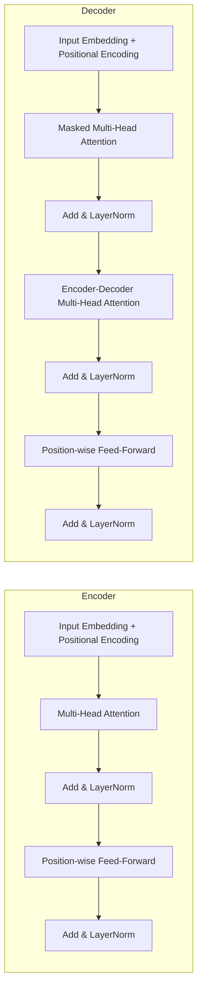

# Understanding Self-Attention: The Core of Modern Deep Learning

## Introduction to Attention Mechanisms

In the early days of deep learning, sequence models such as recurrent neural networks (RNNs) and convolutional neural networks (CNNs) struggled to capture long‑range dependencies. A classic example is machine translation: translating a word at the end of a sentence often requires context from the very beginning. Traditional architectures forced information to pass through a fixed‑size hidden state, leading to vanishing gradients and a loss of detail as the sequence grew longer.

### Why we needed attention

- **Dynamic focus** – Instead of compressing an entire sequence into a single vector, attention lets the model **selectively weight** each input element based on its relevance to the current decoding step.
- **Interpretability** – The attention weights act as a soft alignment map, offering a window into *what* the model is looking at when making a prediction.
- **Efficiency in learning** – By providing a direct path for gradient flow between distant tokens, attention mitigates the vanishing‑gradient problem that plagued RNNs.

### Historical milestones

| Year | Milestone | Contribution |
|------|-----------|--------------|
| 2014 | **Bahdanau et al., “Neural Machine Translation by Jointly Learning to Align and Translate”** | Introduced the first *soft* alignment mechanism for encoder‑decoder models, enabling the decoder to attend to encoder states dynamically. |
| 2015 | **Luong et al., “Effective Approaches to Attention-based Neural Machine Translation”** | Proposed several scoring functions (dot, general, concat) and demonstrated that attention improves translation quality across languages. |
| 2017 | **Vaswani et al., “Attention Is All You Need”** | Replaced recurrence entirely with **self‑attention**, showing that a stack of attention layers (the Transformer) can surpass RNN‑based models in speed and performance. |

These breakthroughs paved the way for the **self‑attention** paradigm that underlies modern language models, vision transformers, and many cross‑modal architectures.

### Why self‑attention matters

1. **Parallelism** – Unlike RNNs, self‑attention computes relationships between all token pairs simultaneously, leveraging GPU/TPU parallelism for massive speed gains.
2. **Long‑range context** – Every token can directly attend to every other token, regardless of distance, making it trivial to capture global dependencies.
3. **Scalability** – Stacking self‑attention layers yields representations that grow richer with depth, a property that scales well to billions of parameters.
4. **Versatility** – The same mechanism can be applied to text, images, audio, and graph data, unifying disparate domains under a single architectural principle.

In short, attention started as a clever way to align source and target sequences, but its self‑referential extension—self‑attention—has become the *core* of modern deep learning, enabling models to reason about entire inputs holistically and efficiently.

## Mathematical Foundations of Self‑Attention

Self‑attention allows a sequence of token embeddings \(\mathbf{X} \in \mathbb{R}^{N \times d_{\text{model}}}\) (where \(N\) is the sequence length) to interact with itself and produce a new representation \(\mathbf{Z}\) that captures contextual relationships. The core of this mechanism is the **query‑key‑value (QKV) formulation**.

---

### 1. From Input Embeddings to Queries, Keys, and Values  

For each token we linearly project the input embedding into three distinct spaces:

\[
\begin{aligned}
\mathbf{Q} &= \mathbf{X}\mathbf{W}^{Q} \quad &\in \mathbb{R}^{N \times d_k},\\[4pt]
\mathbf{K} &= \mathbf{X}\mathbf{W}^{K} \quad &\in \mathbb{R}^{N \times d_k},\\[4pt]
\mathbf{V} &= \mathbf{X}\mathbf{W}^{V} \quad &\in \mathbb{R}^{N \times d_v},
\end{aligned}
\]

where \(\mathbf{W}^{Q},\mathbf{W}^{K}\in\mathbb{R}^{d_{\text{model}}\times d_k}\) and \(\mathbf{W}^{V}\in\mathbb{R}^{d_{\text{model}}\times d_v}\) are learnable weight matrices. Typically \(d_k = d_v = d_{\text{model}}/h\) for an \(h\)-head multi‑head attention block.

---

### 2. Scaled Dot‑Product Attention  

The similarity between a **query** \(\mathbf{q}_i\) (row \(i\) of \(\mathbf{Q}\)) and all **keys** \(\mathbf{k}_j\) (rows of \(\mathbf{K}\)) is measured by a dot product. To keep the magnitude of the dot product stable as \(d_k\) grows, we scale it by \(\sqrt{d_k}\):

\[
\alpha_{ij} \;=\; \frac{\mathbf{q}_i \mathbf{k}_j^{\top}}{\sqrt{d_k}}.
\]

Collecting all pairwise scores yields the matrix

\[
\mathbf{S} = \frac{\mathbf{Q}\mathbf{K}^{\top}}{\sqrt{d_k}} \;\in\; \mathbb{R}^{N \times N}.
\]

---

### 3. Softmax Normalisation  

The raw scores \(\mathbf{S}\) are turned into a valid probability distribution over the tokens using the softmax function applied **row‑wise**:

\[
\mathbf{A}_{i,:} = \operatorname{softmax}\!\bigl(\mathbf{S}_{i,:}\bigr)
               = \frac{\exp\!\bigl(\mathbf{S}_{i,:}\bigr)}
                      {\sum_{j=1}^{N}\exp\!\bigl(\mathbf{S}_{i,j}\bigr)}.
\]

The resulting attention matrix \(\mathbf{A}\in\mathbb{R}^{N\times N}\) contains the weight that token \(i\) assigns to every token \(j\).

---

### 4. Weighted Sum of Values  

Each output token is a weighted sum of the value vectors, using the attention weights as coefficients:

\[
\mathbf{Z} = \mathbf{A}\mathbf{V} \;\in\; \mathbb{R}^{N \times d_v}.
\]

Putting everything together, the **scaled dot‑product attention** can be expressed compactly as

\[
\boxed{\;\operatorname{Attention}(\mathbf{Q},\mathbf{K},\mathbf{V})
      = \operatorname{softmax}\!\Bigl(\frac{\mathbf{Q}\mathbf{K}^{\top}}{\sqrt{d_k}}\Bigr)\mathbf{V}\;}
\]

---

### 5. Multi‑Head Extension (Brief)

When using \(h\) heads, we repeat the above steps on \(h\) independent linear projections and concatenate the results:

\[
\operatorname{MHA}(\mathbf{X}) = \operatorname{Concat}\bigl(\text{head}_1,\dots,\text{head}_h\bigr)\mathbf{W}^{O},
\]
\[
\text{head}_i = \operatorname{Attention}\!\bigl(\mathbf{X}\mathbf{W}^{Q}_i,
                                               \mathbf{X}\mathbf{W}^{K}_i,
                                               \mathbf{X}\mathbf{W}^{V}_i\bigr).
\]

The final linear map \(\mathbf{W}^{O}\) restores the dimensionality to \(d_{\text{model}}\).

---

### Key Take‑aways  

* **Queries, Keys, Values** are linear projections of the same input.  
* The **dot‑product** measures similarity; dividing by \(\sqrt{d_k}\) prevents large variances.  
* **Softmax** converts scores into a probability distribution, enabling differentiable weighting.  
* The **output** is a context‑aware mixture of value vectors, which can be stacked (multi‑head) to capture diverse relational patterns.

## Self‑Attention in Practice: The Transformer Architecture

The Transformer [1] popularised self‑attention as the core building block for sequence modelling. Below we break down how self‑attention is woven into the model, focusing on **multi‑head attention**, **positional encoding**, and the surrounding feed‑forward layers.

---

### 1. High‑level Blueprint



* Each **Encoder** layer repeats the *MHA → Add&Norm → FFN → Add&Norm* pattern.  
* The **Decoder** adds a *masked* self‑attention (preventing future tokens) and a second attention block that attends to the encoder outputs.

---

### 2. From Tokens to Queries, Keys, Values

Given an input sequence of length \(n\) with token embeddings \(\mathbf{X}\in\mathbb{R}^{n\times d_{\text{model}}}\):

\[
\begin{aligned}
\mathbf{Q} &= \mathbf{X}\mathbf{W}^{Q},\\
\mathbf{K} &= \mathbf{X}\mathbf{W}^{K},\\
\mathbf{V} &= \mathbf{X}\mathbf{W}^{V},
\end{aligned}
\]

where \(\mathbf{W}^{Q},\mathbf{W}^{K},\mathbf{W}^{V}\in\mathbb{R}^{d_{\text{model}}\times d_k}\) are learned projections (typically \(d_k = d_v = d_{\text{model}}/h\), with \(h\) heads).

---

### 3. Scaled Dot‑Product Attention

For a single head:

\[
\text{Attention}(\mathbf{Q},\mathbf{K},\mathbf{V}) =
\operatorname{softmax}\!\left(\frac{\mathbf{Q}\mathbf{K}^{\top}}{\sqrt{d_k}}\right)\mathbf{V}
\]

*The scaling factor \(\sqrt{d_k}\) stabilises gradients when \(d_k\) grows.*

---

### 4. Multi‑Head Attention (MHA)

Instead of a single set of \((\mathbf{Q},\mathbf{K},\mathbf{V})\), the model computes **\(h\) parallel heads**:

```python
def multi_head_attention(X, mask=None):
    # X: (batch, seq_len, d_model)
    Q = X @ W_Q   # (batch, seq_len, h * d_k)
    K = X @ W_K
    V = X @ W_V

    # reshape for multi‑head computation
    Q = Q.view(batch, seq_len, h, d_k).transpose(1,2)   # (batch, h, seq_len, d_k)
    K = K.view(...).transpose(1,2)
    V = V.view(...).transpose(1,2)

    # scaled dot‑product per head
    scores = (Q @ K.transpose(-2, -1)) / sqrt(d_k)      # (batch, h, seq_len, seq_len)
    if mask is not None:
        scores = scores.masked_fill(mask == 0, -1e9)
    attn = softmax(scores, dim=-1) @ V                # (batch, h, seq_len, d_v)

    # concatenate heads and final linear projection
    attn = attn.transpose(1,2).contiguous().view(batch, seq_len, h*d_v)
    return attn @ W_O                                   # (batch, seq_len, d_model)
```

* **Why multiple heads?** Each head can attend to different subspaces of the representation, allowing the model to capture diverse patterns (e.g., syntax vs. semantics) simultaneously.

---

### 5. Positional Encoding

Self‑attention lacks recurrence, so the model must inject **order information**. The original Transformer uses a deterministic sinusoidal encoding:

\[
\text{PE}_{(pos,2i)}   = \sin\!\left(\frac{pos}{10000^{2i/d_{\text{model}}}}\right),\qquad
\text{PE}_{(pos,2i+1)} = \cos\!\left(\frac{pos}{10000^{2i/d_{\text{model}}}}\right)
\]

* `pos` – token index in the sequence.  
* `i` – dimension index.

The final input to the encoder/decoder is:

\[
\mathbf{Z}_0 = \mathbf{X} + \text{PE}
\]

Because the sinusoidal functions are linearly independent, the model can **extrapolate to sequence lengths longer than those seen during training**.

*Modern variants* sometimes replace sinusoidal PE with **learnable embeddings** or **relative‑position bias matrices**, but the principle—adding a positional signal before attention—remains unchanged.

---

### 6. Putting It All Together (Encoder Layer)

1. **Self‑Attention Sub‑layer**  
   \[
   \mathbf{A} = \text{MHA}(\mathbf{Z}_\ell, \mathbf{Z}_\ell, \mathbf{Z}_\ell)
   \]
2. **Residual + LayerNorm**  
   \[
   \mathbf{B} = \text{LayerNorm}(\mathbf{Z}_\ell + \mathbf{A})
   \]
3. **Position‑wise Feed‑Forward Network (FFN)**  
   \[
   \mathbf{C} = \text{FFN}(\mathbf{B}) = \max(0, \mathbf{B}\mathbf{W}_1 + \mathbf{b}_1)\mathbf{W}_2 + \mathbf{b}_2
   \]
4. **Second Residual + LayerNorm**  
   \[
   \mathbf{Z}_{\ell+1} = \text{LayerNorm}(\mathbf{B} + \mathbf{C})
   \]

The decoder follows the same pattern, with the two attention sub‑layers (masked self‑attention → encoder‑decoder attention) inserted before the FFN.

---

### 7. Key Takeaways

| Component | Role in the Transformer |
|-----------|--------------------------|
| **Self‑Attention** | Computes pairwise token interactions in parallel, enabling global context. |
| **Multi‑Head** | Allows the model to attend to different representation subspaces simultaneously. |
| **Positional Encoding** | Supplies order information that pure attention cannot infer. |
| **Residual + LayerNorm** | Stabilises training of deep stacks (often 6–12 layers). |
| **Feed‑Forward Network** | Provides per‑position non‑linear transformation, increasing model capacity. |

Together, these pieces turn the abstract self‑attention operation into a **practical, highly scalable architecture** that underpins modern language models, vision transformers, and many other deep‑learning breakthroughs.

## Implementation Walkthrough (Python & PyTorch)

Below is a minimal, **from‑scratch** implementation of a single‑head self‑attention layer in PyTorch.  
We will:

1. Define the `SelfAttention` module (query, key, value projections + scaled dot‑product).  
2. Create a tiny toy sequence (batch = 1, length = 5, embedding = 4).  
3. Pass the data through the layer and inspect the attention weights and output.

```python
import torch
import torch.nn as nn
import torch.nn.functional as F

class SelfAttention(nn.Module):
    """
    Simple single‑head self‑attention.
    Input shape: (batch, seq_len, embed_dim)
    Output shape: (batch, seq_len, embed_dim)
    """
    def __init__(self, embed_dim):
        super().__init__()
        self.embed_dim = embed_dim

        # Linear projections for Q, K, V
        self.W_q = nn.Linear(embed_dim, embed_dim, bias=False)
        self.W_k = nn.Linear(embed_dim, embed_dim, bias=False)
        self.W_v = nn.Linear(embed_dim, embed_dim, bias=False)

        # Optional output projection (often omitted for a single layer)
        self.W_o = nn.Linear(embed_dim, embed_dim, bias=False)

    def forward(self, x):
        """
        x: (B, T, D)
        Returns:
            out: (B, T, D)
            attn_weights: (B, T, T) – attention matrix for each batch element
        """
        B, T, D = x.size()

        # 1) Project inputs
        Q = self.W_q(x)   # (B, T, D)
        K = self.W_k(x)   # (B, T, D)
        V = self.W_v(x)   # (B, T, D)

        # 2) Compute scaled dot‑product attention scores
        #    Q·Kᵀ → (B, T, T)
        scores = torch.matmul(Q, K.transpose(-2, -1)) / torch.sqrt(torch.tensor(D, dtype=torch.float32))

        # 3) Softmax over the key dimension (last dim)
        attn_weights = F.softmax(scores, dim=-1)   # (B, T, T)

        # 4) Weighted sum of values
        context = torch.matmul(attn_weights, V)    # (B, T, D)

        # 5) Final linear projection (optional)
        out = self.W_o(context)                    # (B, T, D)

        return out, attn_weights


# --------------------------------------------------------------
# Toy example
# --------------------------------------------------------------
torch.manual_seed(0)   # reproducibility

batch_size   = 1
seq_len      = 5
embed_dim    = 4

# Random toy sequence (e.g. word embeddings)
x = torch.randn(batch_size, seq_len, embed_dim)

print("Input sequence (batch, seq_len, embed_dim):")
print(x)

# Instantiate and run the layer
self_attn = SelfAttention(embed_dim)
output, weights = self_attn(x)

print("\nAttention weights (shape = batch × seq_len × seq_len):")
print(weights.squeeze(0).detach().numpy())

print("\nOutput after self‑attention (same shape as input):")
print(output.squeeze(0).detach().numpy())
```

### What the code does

| Step | Operation | Shape |
|------|-----------|-------|
| **Input** | Random embeddings | `(1, 5, 4)` |
| **Linear projections** | `Q, K, V = X·W` | `(1, 5, 4)` each |
| **Score matrix** | `Q·Kᵀ / √D` | `(1, 5, 5)` |
| **Softmax** | Convert scores → probabilities | `(1, 5, 5)` |
| **Context** | `weights·V` | `(1, 5, 4)` |
| **Output projection** | `context·W_o` | `(1, 5, 4)` |

### Quick sanity checks

- **Rows of the attention matrix sum to 1** (softmax over keys).  
- The output retains the original `(batch, seq_len, embed_dim)` shape, making it easy to stack multiple such layers or feed into a feed‑forward network.

You can now plug `SelfAttention` into a larger transformer block, add multi‑head support, or experiment with masking for causal language modeling. Happy coding!

## Benefits and Limitations

### Benefits
- **Massive Parallelism**  
  Self‑attention computes interactions between all token pairs simultaneously, allowing modern GPUs/TPUs to process entire sequences in parallel rather than step‑by‑step as in recurrent networks.

- **Modeling Long‑Range Dependencies**  
  Every token can attend to every other token, so information can flow across arbitrarily long distances without the vanishing‑gradient problems that plague RNNs and CNNs.

- **Dynamic Contextualization**  
  The attention weights are data‑dependent, enabling the model to focus on the most relevant parts of the input for each token, which improves representation quality across tasks such as translation, summarization, and vision‑language integration.

- **Architectural Simplicity**  
  The same self‑attention block can be stacked repeatedly, leading to uniform, modular architectures (e.g., Transformers) that are easier to scale and debug.

### Limitations
- **Quadratic Computational and Memory Cost**  
  Computing the full attention matrix scales as \(O(N^2)\) with sequence length \(N\), quickly becoming prohibitive for long inputs (e.g., documents, high‑resolution images, or video frames).

- **Data Hunger**  
  Because self‑attention models have many parameters and rely on rich pairwise interactions, they typically require massive datasets to avoid over‑fitting and to fully exploit their capacity.

- **Lack of Explicit Hierarchical Bias**  
  Unlike CNNs or hierarchical RNNs, vanilla self‑attention does not inherently encode locality or multi‑scale structure, which can lead to inefficiencies when processing data with strong spatial or temporal hierarchies.

- **Sensitivity to Tokenization and Sequence Length**  
  The performance can degrade if the chosen token granularity yields overly long sequences (inflating the quadratic cost) or overly short ones (losing fine‑grained detail).

## Variants and Extensions

The vanilla self‑attention mechanism introduced in the original Transformer is powerful but scales quadratically with sequence length, which can become a bottleneck for long inputs. Over the past few years, a wave of **efficient attention** variants has emerged. Below we highlight three influential families—**Linformer**, **Performer**, and **Sparse Attention**—and give practical guidance on when each is the right tool for the job.

| Variant | Core Idea | Complexity | Typical Use‑Cases |
|---------|-----------|------------|-------------------|
| **Linformer** | Projects the \(N \times d\) key and value matrices onto a low‑dimensional subspace using a learned linear projection \(E \in \mathbb{R}^{N \times k}\) (with \(k \ll N\)). The attention matrix is approximated as \(Q (E^T K)^T\). | \(O(Nk d)\) → linear in sequence length (if \(k\) is constant) | Text classification or language modeling where the sequence length is moderate (up to a few thousand tokens) and you still want a dense representation. |
| **Performer** | Replaces the softmax kernel with a **positive‑definite kernel** (e.g., random feature approximation of the Gaussian kernel). This yields a **linear‑time** formulation: \(\text{Attention}(Q,K,V) \approx \phi(Q)\big(\phi(K)^T V\big)\). | \(O(N d r)\) where \(r\) is the number of random features (typically 64–256) | Very long sequences (e.g., DNA, audio, video frames) where exact softmax is unnecessary and you need a provable bound on approximation error. |
| **Sparse Attention** (e.g., Longformer, BigBird, Routing Transformer) | Enforces a **sparsity pattern** on the attention matrix (local windows, global tokens, random connections, or learned routing). Only a subset of \(QK^T\) entries are computed. | \(O(N \cdot \text{window\_size})\) or \(O(N \log N)\) depending on pattern | Documents with hierarchical structure (legal contracts, scientific papers), code, or any data where locality dominates but occasional long‑range dependencies are crucial. |

### How to Choose

1. **Sequence length ≤ 2 k tokens**  
   - *Linformer* often gives the best trade‑off: you retain a dense attention matrix (so the model can still capture global interactions) while cutting memory roughly by a factor of \(N/k\).  
   - If you need exact softmax behavior (e.g., for fine‑grained token‑level alignment), stick with the original attention.

2. **Sequence length > 2 k tokens**  
   - *Performer* shines when you can tolerate a **kernel‑based approximation**. It is especially attractive for training on GPUs/TPUs because the operations are fully matrix‑multiplications without any masking overhead.  
   - Use it for **continuous‑signal domains** (audio, time‑series) where the kernel interpretation aligns with the underlying similarity measure.

3. **Strong locality + occasional global hops**  
   - *Sparse attention* patterns (sliding windows + a few global tokens) give you near‑linear scaling while preserving crucial long‑range links.  
   - Ideal for **long documents**, **code repositories**, or **graph‑structured inputs** where the majority of dependencies are local but some “anchor” tokens (e.g., section headings, function definitions) need to attend globally.

4. **Memory‑constrained inference (edge devices)**  
   - Combine *Linformer* with **weight sharing** across layers or adopt a **low‑rank factorization** of the projection matrices to squeeze the model further.  
   - *Performer* can also be run with a reduced number of random features, trading a bit of accuracy for a smaller memory footprint.

### Quick Implementation Checklist

- **Linformer**  
  ```python
  from linformer import Linformer
  encoder = Linformer(
      dim=512,
      seq_len=4096,
      k=256,               # projection dimension
      heads=8,
      layers=6
  )
  ```
- **Performer**  
  ```python
  from performer_pytorch import Performer
  model = Performer(
      dim=512,
      depth=6,
      heads=8,
      causal=False,
      feature_redraw_interval=1000   # refresh random features periodically
  )
  ```
- **Sparse (Longformer)**  
  ```python
  from transformers import LongformerModel, LongformerConfig
  config = LongformerConfig(
      attention_window=512,   # local window size
      global_attn=True       # enable global tokens
  )
  model = LongformerModel(config)
  ```

### Bottom Line

- **Linformer** = linear‑time *dense* approximation → best for moderate‑length sequences where you still want global context.  
- **Performer** = linear‑time *kernel* approximation → ideal for very long inputs and continuous domains.  
- **Sparse Attention** = linear‑time *structured* sparsity → perfect for long, hierarchical texts or code where locality dominates.

Choosing the right variant is often a matter of matching **sequence length**, **desired fidelity of global interactions**, and **hardware constraints**. Experimenting with a small proxy dataset using the same architecture but swapping the attention type is usually the fastest way to discover the sweet spot for your application.

## Conclusion and Further Reading

### Key Takeaways
- **Self‑attention** is the mechanism that lets a model weigh the relevance of every token to every other token, enabling rich contextual representations.
- It replaces recurrent or convolutional bottlenecks, offering **parallelizable** computation and **long‑range dependency** modeling.
- The **scaled dot‑product** formulation, multi‑head design, and residual connections are the core ingredients that make self‑attention both powerful and stable.
- Modern architectures (Transformers, Vision Transformers, BERT, GPT, etc.) build on this primitive, demonstrating its versatility across NLP, vision, speech, and multimodal tasks.
- Understanding the **mathematics** (query, key, value projections, attention scores, softmax scaling) and **implementation nuances** (masking, efficient kernels) is essential for both research and production work.

### Suggested Resources

#### Foundational Papers
- **“Attention Is All You Need”** – Vaswani et al., 2017  
  *The original Transformer paper introducing scaled dot‑product attention and multi‑head mechanisms.*  
- **“BERT: Pre‑training of Deep Bidirectional Transformers for Language Understanding”** – Devlin et al., 2018  
  *Shows how self‑attention can be leveraged for powerful pre‑training.*  
- **“Vision Transformer (ViT)”** – Dosovitskiy et al., 2020  
  *Adapts self‑attention to image patches, opening the door to transformer‑based vision models.*  

#### Tutorials & Blog Posts
- **The Illustrated Transformer** – Jay Alammar  
  *(https://jalammar.github.io/illustrated-transformer/)* – Visual, step‑by‑step walkthrough.  
- **A Gentle Introduction to Self‑Attention** – Lilian Weng  
  *(https://lilianweng.github.io/posts/2020-04-07-self-attention/)* – Intuitive explanations with code snippets.  
- **Understanding Multi‑Head Attention** – Chris Olah (Distill)  
  *(https://distill.pub/2020/attention/)* – Deep dive into the why and how of multiple heads.  

#### Books
- **“Deep Learning for NLP”** – Palash Goyal, Sumit Pandey, and Karan Jain (2021) – Chapter on transformers and self‑attention.  
- **“Natural Language Processing with Transformers”** – Lewis Tunstall, Leandro von Werra, Thomas Wolf (2022) – Practical guide with Hugging Face examples.  

#### Open‑Source Projects & Libraries
- **🤗 Hugging Face Transformers** – The go‑to library for pretrained transformer models and utilities.  
- **Fairseq** (Meta AI) – Research‑grade sequence modeling toolkit with flexible attention modules.  
- **timm (PyTorch Image Models)** – Includes Vision Transformer implementations and training scripts.  
- **JAX/Flax implementations** – e.g., *flaxformer* for high‑performance research experiments.  

#### Hands‑On Explorations
1. **Re‑implement Scaled Dot‑Product Attention** from scratch in PyTorch/TensorFlow to cement the math.  
2. **Fine‑tune a BERT model** on a downstream task (e.g., sentiment analysis) using the Hugging Face Trainer API.  
3. **Experiment with Sparse/Linear Attention** variants (e.g., Longformer, Performer) to handle longer sequences efficiently.  
4. **Build a Vision Transformer** on a small dataset (CIFAR‑10/100) and compare its performance against a ResNet baseline.  

### Where to Go Next?
- Dive into **efficient attention** research (e.g., Linformer, Reformer, FlashAttention) for scaling to massive inputs.  
- Explore **multimodal transformers** (e.g., CLIP, Flamingo) that fuse text and vision through shared attention mechanisms.  
- Follow the latest conferences (NeurIPS, ICML, ICLR, CVPR) for emerging architectures that push the boundaries of self‑attention.  

By mastering self‑attention’s fundamentals and exploring these resources, you’ll be equipped to both apply state‑of‑the‑art models and contribute to the next wave of transformer innovations. Happy reading and coding!
